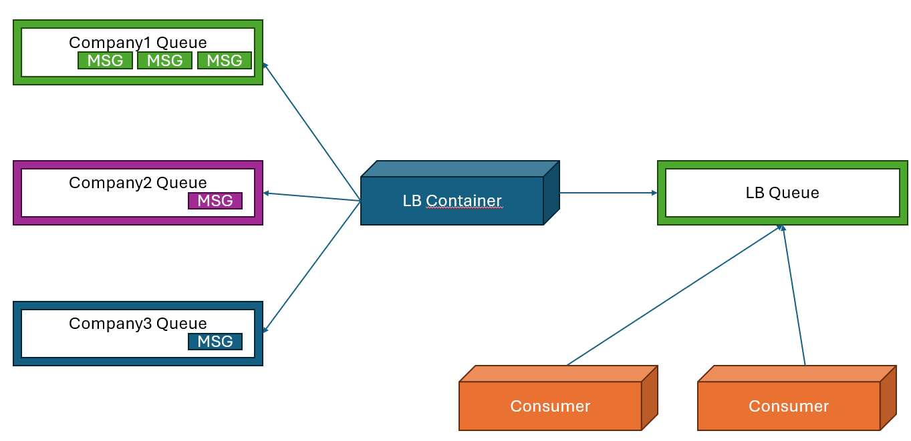

# RabbitMQ Queue LoadBalancer
This project aims to create a load balancer between multiple queues by utilizing **round robin algorithm**. The LoadBalancer works as an intermediary and routes the messages to another queue. This queue then is consumed by consumers.
## How does it Work?
It sequentally iterates the registered queues and push the messages one by one to load balancer queue. In order to avoid lb queue beign overflowed with same origin messages, lb queue size is set to 3. You can change this size in the code.

## Environment Variables
**RABBITMQ_HOST**: Rabbitmq server<br />
**RABBITMQ_USER**: Rabbitmq auth user<br />
**RABBITMQ_PASSWORD**: Rabbitmq auth password<br />
**RABBITMQ_LB_QUEUE_NAME**: The queue name where the message will be forwarded. This is the queue name which your consumer will consume.<br />
**RABBITMQ_REGISTERED_QUEUE_LIST**: Coma separated queue list which you want to load balance with.<br />
**"LB_WAIT_INTERVAL"**: Loadbalancer wait interval to avoid high CPU utilization.
## Proof of Concept
Following workflow show how the loadbalancer work. Copy the following docker compose file to `docker-compose.yaml` file

```yaml
services:
  rabbitmq:
    image: rabbitmq:3.13.7-management
    container_name: rabbitmqlocal
    restart: always
    environment:
      RABBITMQ_DEFAULT_PASS: admin
      RABBITMQ_DEFAULT_USER: admin
    ports:
      - 5672:5672
      - 15672:15672
      - 15692:15692
    healthcheck:
      test: ["CMD", "rabbitmq-diagnostics", "-q", "ping"]
      interval: 30s
      timeout: 10s
      retries: 5
  
  consumer:
    image: akkayaumut/rabbitconsumer:0.9
    restart: always
    deploy:
      replicas: 1
    depends_on:
      rabbitmq:
        condition: service_healthy
      queue_load_balancer:
        condition: service_started
    environment:
      RABBITMQ_HOST: rabbitmqlocal
      RABBITMQ_QUEUE_NAME: lb_queue
      RABBITMQ_USER: admin
      RABBITMQ_PASSWORD: admin
      INTERVAL: 2


  publisher_company3:
    image: akkayaumut/rabbitpublisher:0.4
    restart: always
    depends_on:
      rabbitmq:
        condition: service_healthy
    environment:
      RABBITMQ_HOST: rabbitmqlocal
      RABBITMQ_QUEUE_NAME: company3
      RABBITMQ_USER: admin
      RABBITMQ_PASSWORD: admin
      INTERVAL: 3
  
  publisher_company1:
    image: akkayaumut/rabbitpublisher:0.4
    restart: always
    depends_on:
      rabbitmq:
        condition: service_healthy
    environment:
      RABBITMQ_HOST: rabbitmqlocal
      RABBITMQ_QUEUE_NAME: company1
      RABBITMQ_USER: admin
      RABBITMQ_PASSWORD: admin
      INTERVAL: 2
  
  publisher_company2:
    image: akkayaumut/rabbitpublisher:0.4
    restart: always
    depends_on:
      rabbitmq:
        condition: service_healthy
    environment:
      RABBITMQ_HOST: rabbitmqlocal
      RABBITMQ_QUEUE_NAME: company2
      RABBITMQ_USER: admin
      RABBITMQ_PASSWORD: admin
      INTERVAL: 1
      
  
  queue_load_balancer:
    image: akkayaumut/test-lb:0.0.1
    restart: always
    depends_on:
      rabbitmq:
        condition: service_healthy
      publisher_company1:
        condition: service_started
      publisher_company2:
        condition: service_started
      publisher_company3:
        condition: service_started
    environment:
      RABBITMQ_HOST: rabbitmqlocal
      RABBITMQ_LB_QUEUE_NAME: lb_queue
      RABBITMQ_REGISTERED_QUEUE_LIST: company1,company2,company3
      RABBITMQ_USER: admin
      RABBITMQ_PASSWORD: admin
      LB_WAIT_INTERVAL: 0.1
  ```

  Start the test environment

```
docker compose up
```
After the a few minutes later check the logs of consumer. You will see that messages are processed evenly.
```
docker logs COMPOSE-PROJECT-NAME-consumer-1
QueueName: company1 Message: 9
QueueName: company2 Message: 93
QueueName: company3 Message: 31
QueueName: company2 Message: 56
QueueName: company3 Message: 62
QueueName: company1 Message: 43
QueueName: company2 Message: 93
QueueName: company3 Message: 94
QueueName: company1 Message: 51
QueueName: company2 Message: 7
QueueName: company3 Message: 50
QueueName: company1 Message: 60
QueueName: company2 Message: 38
```